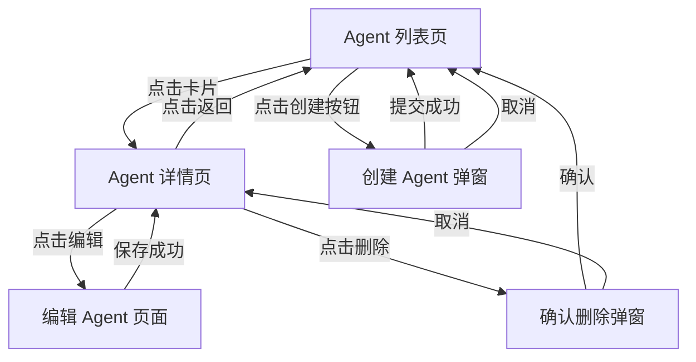

# PRD-TO-UI-SPEC — PRD 转 UI 设计规范

## 目标

将 PRD 中的产品需求转化为结构化的 UI 设计规范文档，覆盖 Design Token、页面线框图、组件规范、交互状态、页面流转、响应式规则等，让前端开发人员有明确的视觉基准可依据。

**核心隐喻**：你是一个"UX/UI 设计师"——把产品经理的功能描述翻译成视觉语言。每个页面都有清晰的布局，每个组件都有明确的尺寸和状态，每个交互都有定义好的反馈。

---

## 设计原则

1. **KB 驱动**：优先复用项目现有的 Design Token 和组件样式，保持视觉一致性
2. **文本可执行**：所有规范都用结构化文本表达（ASCII 线框图 + 表格），开发人员可直接转化为代码
3. **Antd 优先**：组件规范基于 Antd 6 组件库，不引入新的 UI 库
4. **状态完整**：每个组件定义所有交互状态（默认、Hover、Active、Disabled、Loading、Error、Empty）
5. **Figma 可选增强**：如果有 Figma 设计稿，通过 Figma MCP 读取 Design Token 作为输入

---

## 适用技术栈

| 层级 | 技术 | 说明 |
|------|------|------|
| UI 组件库 | Antd 6 | 基础组件 |
| 样式方案 | TailwindCSS | 原子化 CSS |
| 图标 | Lucide React | 图标库 |
| 字体 | 系统默认 | -apple-system, BlinkMacSystemFont |

---

## 输入

| 参数 | 必填 | 说明 |
|------|------|------|
| **PRD 文件** | ✅ | `version-doc/{版本号}/prd/prd.md` |
| **版本号** | ✅ | 如 `v1.0.1`，用于确定输入/输出目录 |
| **目标应用** | 否 | `web` / `admin` / `both`，默认根据 PRD 内容自动判断 |
| **Figma 文件** | 否 | Figma 文件 URL（如有，通过 Figma MCP 读取 Design Token） |
| **设计风格** | 否 | `minimal`（简洁）/ `rich`（丰富）/ `dashboard`（数据面板），默认 `minimal` |

**版本号获取规则**：
1. 如果用户直接指定了版本号 → 使用用户指定的
2. 如果文件路径中包含版本号 → 从路径提取
3. 如果以上未提供 → **向用户询问版本号**，不可跳过

## 输出

**输出位置**：`version-doc/{版本号}/design/`

| 文件 | 说明 |
|------|------|
| `ui-spec.md` | 完整的 UI 设计规范文档 |

---

## 编排流程

### 第 0 步：检查前置条件

1. 检查 `version-doc/{版本号}/prd/prd.md` 是否存在
   - 不存在 → 提示用户先执行 `prd-brd-to-prd` Skill
2. 检查是否有 Figma 文件输入
   - 有 → 通过 Figma MCP 读取 Design Token
   - 无 → 使用项目默认 Design Token
3. 检查 KB 是否存在
   - `kb/frontend/` 存在 → 读取现有组件样式作为基准
   - 不存在 → 使用 Antd 6 默认样式

### 第 1 步：读取 PRD 并提取 UI 需求

读取 `version-doc/{版本号}/prd/prd.md`，提取：
- 所有涉及的页面及其功能描述
- 交互流程（用户操作步骤）
- 数据展示需求（列表、表格、卡片、图表等）
- 表单需求（字段、校验规则）
- 弹窗/抽屉需求
- 导航结构变更

### 第 2 步：查阅 KB 获取现有设计基准

读取以下 KB 文件，提取现有的设计模式：

| KB 文件 | 提取内容 |
|---------|---------|
| `kb/frontend/@agency/{app}/00_project_map.md` | 项目整体布局结构 |
| `kb/frontend/@agency/{app}/01_index_page.md` | 现有页面的布局模式 |
| `kb/frontend/@agency/{app}/02_index_component.md` | 现有公共组件的样式模式 |

**从 KB 中提取的设计基准**：
- 页面整体布局（侧边栏 + 顶栏 + 内容区）
- 列表页的通用布局模式
- 详情页的通用布局模式
- 表单页的通用布局模式
- 已使用的 Antd 组件及其配置方式
- 已使用的 TailwindCSS 类名模式

### 第 3 步：定义 Design Token

#### 3.1 色彩系统

```markdown
### 色彩系统

#### 主色调
| Token | 值 | TailwindCSS | 用途 |
|-------|-----|------------|------|
| --color-primary | #1677ff | text-blue-500 | 主操作按钮、链接、选中态 |
| --color-primary-hover | #4096ff | hover:text-blue-400 | 主色 Hover 态 |
| --color-primary-bg | #e6f4ff | bg-blue-50 | 主色背景（选中行、标签背景） |

#### 语义色
| Token | 值 | TailwindCSS | 用途 |
|-------|-----|------------|------|
| --color-success | #52c41a | text-green-500 | 成功状态、运行中 |
| --color-warning | #faad14 | text-yellow-500 | 警告状态、待处理 |
| --color-error | #ff4d4f | text-red-500 | 错误状态、已停用 |
| --color-info | #1677ff | text-blue-500 | 信息提示 |

#### 中性色
| Token | 值 | TailwindCSS | 用途 |
|-------|-----|------------|------|
| --color-text-primary | #1f2937 | text-gray-800 | 主要文字 |
| --color-text-secondary | #6b7280 | text-gray-500 | 次要文字、描述 |
| --color-text-disabled | #d1d5db | text-gray-300 | 禁用文字 |
| --color-border | #e5e7eb | border-gray-200 | 边框、分割线 |
| --color-bg-page | #f9fafb | bg-gray-50 | 页面背景 |
| --color-bg-card | #ffffff | bg-white | 卡片/面板背景 |
```

#### 3.2 间距系统

```markdown
### 间距系统

| Token | 值 | TailwindCSS | 用途 |
|-------|-----|------------|------|
| --spacing-xs | 4px | p-1 / m-1 | 紧凑间距（图标与文字） |
| --spacing-sm | 8px | p-2 / m-2 | 小间距（表单元素内） |
| --spacing-md | 16px | p-4 / m-4 | 标准间距（卡片内边距） |
| --spacing-lg | 24px | p-6 / m-6 | 大间距（区块间距） |
| --spacing-xl | 32px | p-8 / m-8 | 超大间距（页面边距） |
```

#### 3.3 字体系统

```markdown
### 字体系统

| Token | 大小 | 行高 | 字重 | TailwindCSS | 用途 |
|-------|------|------|------|------------|------|
| --font-h1 | 24px | 32px | 600 | text-2xl font-semibold | 页面主标题 |
| --font-h2 | 20px | 28px | 600 | text-xl font-semibold | 区块标题 |
| --font-h3 | 16px | 24px | 500 | text-base font-medium | 卡片标题 |
| --font-body | 14px | 22px | 400 | text-sm | 正文 |
| --font-caption | 12px | 20px | 400 | text-xs | 辅助文字、标签 |
```

#### 3.4 圆角与阴影

```markdown
### 圆角
| Token | 值 | TailwindCSS | 用途 |
|-------|-----|------------|------|
| --radius-sm | 4px | rounded | 按钮、输入框 |
| --radius-md | 8px | rounded-lg | 卡片、弹窗 |
| --radius-lg | 12px | rounded-xl | 大面板 |
| --radius-full | 9999px | rounded-full | 头像、标签 |

### 阴影
| Token | 值 | TailwindCSS | 用途 |
|-------|-----|------------|------|
| --shadow-sm | 0 1px 2px rgba(0,0,0,0.05) | shadow-sm | 卡片默认 |
| --shadow-md | 0 4px 6px rgba(0,0,0,0.1) | shadow-md | 卡片 Hover、下拉菜单 |
| --shadow-lg | 0 10px 15px rgba(0,0,0,0.1) | shadow-lg | 弹窗 |
```

### 第 4 步：设计页面线框图

对 PRD 中涉及的每个页面，绘制 ASCII 线框图：

**线框图规范**：
- 使用 `┌ ┐ └ ┘ ├ ┤ ┬ ┴ ┼ │ ─` 绘制边框
- 标注关键尺寸（宽度、高度、间距）
- 标注组件类型（`[Button]`、`<Input>`、`{Table}`）
- 标注数据绑定（`{{agentName}}`）
- 标注交互行为（`→ 跳转到详情页`、`↓ 展开下拉`）

**示例**：

```
┌─────────────────────────────────────────────────────────┐
│ [Logo]  Agent 管理    Skill 中心    设置        [头像▼] │  h=56px
├──────────┬──────────────────────────────────────────────┤
│ 侧边栏    │                                              │
│ w=220px  │  Agent 管理                    [+ 创建 Agent] │  ← 页面标题区 h=48px
│          │                                              │
│ ┌──────┐ │  <SearchInput placeholder="搜索 Agent...">   │
│ │▸ 全部 │ │  [标签筛选: 全部 | 开发 | 测试 | 生产]        │  ← 筛选区 h=40px
│ │  运行中│ │                                              │
│ │  已停用│ │  ┌─────────────┐ ┌─────────────┐ ┌────────┐ │
│ │  草稿  │ │  │ 🤖           │ │ 🤖           │ │ 🤖      │ │
│ └──────┘ │  │ {{name}}     │ │ {{name}}     │ │ {{name}}│ │  ← 卡片网格
│          │  │ {{desc}}     │ │ {{desc}}     │ │ {{desc}}│ │     3列 gap=16px
│ ┌──────┐ │  │ [tag] [tag]  │ │ [tag] [tag]  │ │ [tag]  │ │     卡片 min-w=280px
│ │ 快捷   │ │  │ ● 运行中     │ │ ● 已停用     │ │ ● 草稿 │ │
│ │ 操作   │ │  │         [⋯] │ │         [⋯] │ │    [⋯] │ │
│ └──────┘ │  └─────────────┘ └─────────────┘ └────────┘ │
│          │                                              │
│          │  ┌─────────────┐ ┌─────────────┐            │
│          │  │ ...          │ │ ...          │            │
│          │  └─────────────┘ └─────────────┘            │
│          │                                              │
│          │  ← 1  2  3  ...  10 →     共 42 条 / 每页 12 │  ← 分页器
└──────────┴──────────────────────────────────────────────┘
```

### 第 5 步：定义组件规范

对每个新增/修改的组件，定义详细规范：

```markdown
### {ComponentName} 组件规范

**类型**：{Antd 基础组件 / 自定义组件 / 复合组件}
**基于**：{Antd Card / 自定义} 

#### 尺寸与布局

| 属性 | 值 | TailwindCSS |
|------|-----|------------|
| 宽度 | 自适应（min 280px） | min-w-[280px] |
| 内边距 | 16px | p-4 |
| 圆角 | 8px | rounded-lg |
| 边框 | 1px solid #e5e7eb | border border-gray-200 |

#### 内部结构

| 区域 | 内容 | 样式 |
|------|------|------|
| 头部 | 图标(32×32) + 名称(font-h3) | flex items-center gap-3 |
| 中部 | 描述文字(font-body, text-secondary) | mt-2 line-clamp-2 |
| 标签区 | Antd Tag × N | mt-3 flex flex-wrap gap-1 |
| 底部 | 状态指示灯 + 文字 + 操作菜单 | mt-3 flex items-center justify-between |

#### 交互状态

| 状态 | 视觉表现 | TailwindCSS |
|------|---------|------------|
| 默认 | 白色背景 + 灰色边框 | bg-white border-gray-200 |
| Hover | 阴影加深 + 边框变主色 | hover:shadow-md hover:border-blue-300 |
| 选中 | 主色边框 + 浅蓝背景 | border-blue-500 bg-blue-50 |
| 加载中 | 内容区显示 Skeleton | — |
| 禁用 | 整体降低透明度 | opacity-50 pointer-events-none |

#### 操作菜单（⋯ 按钮）

| 菜单项 | 图标 | 操作 |
|--------|------|------|
| 编辑 | ✏️ Edit | → 打开编辑弹窗 |
| 复制 | 📋 Copy | → 复制 Agent 配置 |
| 删除 | 🗑️ Trash | → 确认删除弹窗 |
```

### 第 6 步：定义页面流转图

```markdown
### 页面流转


```

### 第 7 步：定义响应式规则

```markdown
### 响应式断点

| 断点 | 宽度范围 | TailwindCSS | 布局变化 |
|------|---------|------------|---------|
| Desktop XL | ≥1536px | 2xl: | 4列卡片 |
| Desktop | 1280-1535px | xl: | 3列卡片 |
| Tablet | 768-1279px | md: | 侧边栏收起为图标模式，2列卡片 |
| Mobile | <768px | sm: | 无侧边栏，1列卡片，底部 Tab 导航 |

### 响应式行为

| 组件 | Desktop | Tablet | Mobile |
|------|---------|--------|--------|
| 侧边栏 | 展开 w=220px | 收起 w=64px（图标模式） | 隐藏，底部 Tab 替代 |
| 卡片网格 | 3-4列 | 2列 | 1列 |
| 搜索栏 | 内联显示 | 内联显示 | 可折叠 |
| 操作按钮 | 文字+图标 | 仅图标 | 仅图标 |
| 表格 | 完整列 | 隐藏次要列 | 转为卡片列表 |
```

### 第 8 步：定义通用交互规范

```markdown
### 通用交互规范

#### 加载状态
| 场景 | 表现 |
|------|------|
| 页面首次加载 | 全页 Skeleton（Antd Skeleton） |
| 列表加载 | 卡片/行 Skeleton × 6 |
| 按钮提交中 | 按钮显示 Loading 图标 + 禁用 |
| 数据刷新 | 不显示全页 Loading，仅内容区 Spin |

#### 空状态
| 场景 | 表现 |
|------|------|
| 列表无数据 | Antd Empty + 引导文案 + 创建按钮 |
| 搜索无结果 | Empty + "未找到匹配结果，试试其他关键词" |
| 筛选无结果 | Empty + "当前筛选条件下无数据" + 清除筛选按钮 |

#### 操作反馈
| 操作 | 反馈 |
|------|------|
| 创建成功 | Antd message.success("创建成功") + 列表刷新 |
| 更新成功 | message.success("保存成功") |
| 删除成功 | message.success("删除成功") + 列表刷新 |
| 操作失败 | message.error("{错误信息}") |
| 网络错误 | message.error("网络异常，请稍后重试") |

#### 确认操作
| 操作 | 确认方式 |
|------|---------|
| 删除 | Antd Modal.confirm，红色确认按钮 |
| 批量操作 | Modal.confirm，显示影响数量 |
| 离开未保存表单 | 浏览器 beforeunload 提示 |
```

### 第 9 步：Figma MCP 增强（可选）

如果用户提供了 Figma 文件 URL：

1. 通过 Figma MCP 读取设计稿
2. 提取 Design Token（色彩、字体、间距）覆盖默认值
3. 提取组件样式细节（圆角、阴影、渐变等）
4. 提取图标和图片资源列表
5. 在 ui-spec.md 中标注 `📐 来源：Figma`

### 第 10 步：自检

- [ ] 每个 PRD 中的页面都有对应的线框图
- [ ] Design Token 完整（色彩、间距、字体、圆角、阴影）
- [ ] 每个新增组件都有完整的规范（尺寸、状态、交互）
- [ ] 页面流转图覆盖所有用户操作路径
- [ ] 响应式规则覆盖 Desktop/Tablet/Mobile
- [ ] 通用交互规范完整（加载、空状态、反馈、确认）

### 第 11 步：输出摘要

```
## UI 设计规范生成完成

- PRD 来源：version-doc/{版本号}/prd/prd.md
- 目标应用：{web/admin/both}
- Figma 增强：{是/否}
- 输出文件：version-doc/{版本号}/design/ui-spec.md

规范统计：
- Design Token：{N} 个
- 页面线框图：{N} 个
- 组件规范：{N} 个
- 交互状态定义：{N} 个

建议下一步：
1. 使用 `gen-demo-html` 基于 UI 规范生成可交互 Demo
2. 使用 `prd-to-frontend-design` 基于 UI 规范进行前端技术设计
3. 如有 Figma 设计稿，可重新运行本 Skill 并传入 Figma URL 增强
```

---

## 约束

### 设计约束

1. **不引入新 UI 库**：所有组件基于 Antd 6 + TailwindCSS，不引入 Material UI、Chakra 等
2. **不做像素级设计**：线框图表达布局和结构，不追求像素精确
3. **遵循现有风格**：新页面的布局模式应与现有页面一致
4. **TailwindCSS 优先**：样式值优先用 TailwindCSS 类名表达，方便开发直接使用

### 内容约束

1. **不超出 PRD 范围**：只为 PRD 中涉及的页面设计 UI 规范
2. **标注 PRD 来源**：每个页面线框图标注 `来源：PRD 功能模块 {N}`
3. **标注复用/新增**：每个组件标注是复用现有还是新增

### 边界条件处理

| 场景 | 处理方式 |
|------|---------|
| PRD 不存在 | 提示用户先生成 PRD |
| KB 不存在 | 使用 Antd 6 默认样式，标注"⚠️ 未参考 KB" |
| Figma MCP 不可用 | 使用默认 Design Token，标注"⚠️ 未连接 Figma" |
| PRD 中的 UI 描述模糊 | 按 Antd 最佳实践设计，标注 `⚠️ PRD 未明确，按默认模式设计` |
| 涉及复杂图表 | 推荐使用 ECharts/Recharts，给出图表类型建议 |
| 涉及 web 和 admin 两端 | 分别设计，标注共享的 Design Token 和组件 |

---

## Few-Shot 示例

### 示例：Agent 列表页的组件规范

```markdown
### AgentCard 组件规范

**类型**：自定义复合组件
**基于**：Antd Card 变体

#### 尺寸与布局

| 属性 | 值 | TailwindCSS |
|------|-----|------------|
| 宽度 | 自适应（grid 布局） | w-full |
| 最小宽度 | 280px | min-w-[280px] |
| 内边距 | 16px | p-4 |
| 圆角 | 8px | rounded-lg |
| 边框 | 1px solid var(--color-border) | border border-gray-200 |

#### 内部结构

```
┌──────────────────────────────┐
│ 🤖 Agent 名称           [⋯] │  ← 头部：flex justify-between
│                              │
│ 这是一段描述文字，最多显示两  │  ← 描述：line-clamp-2
│ 行，超出部分用省略号...       │
│                              │
│ [开发] [测试]                │  ← 标签：flex-wrap gap-1
│                              │
│ ● 运行中          2024-01-15 │  ← 底部：flex justify-between
└──────────────────────────────┘
```

#### 交互状态

| 状态 | 边框 | 背景 | 阴影 | 光标 |
|------|------|------|------|------|
| 默认 | border-gray-200 | bg-white | shadow-sm | default |
| Hover | border-blue-300 | bg-white | shadow-md | pointer |
| 选中 | border-blue-500 (2px) | bg-blue-50 | shadow-sm | pointer |
| 加载 | border-gray-200 | bg-white | — | wait |
```
